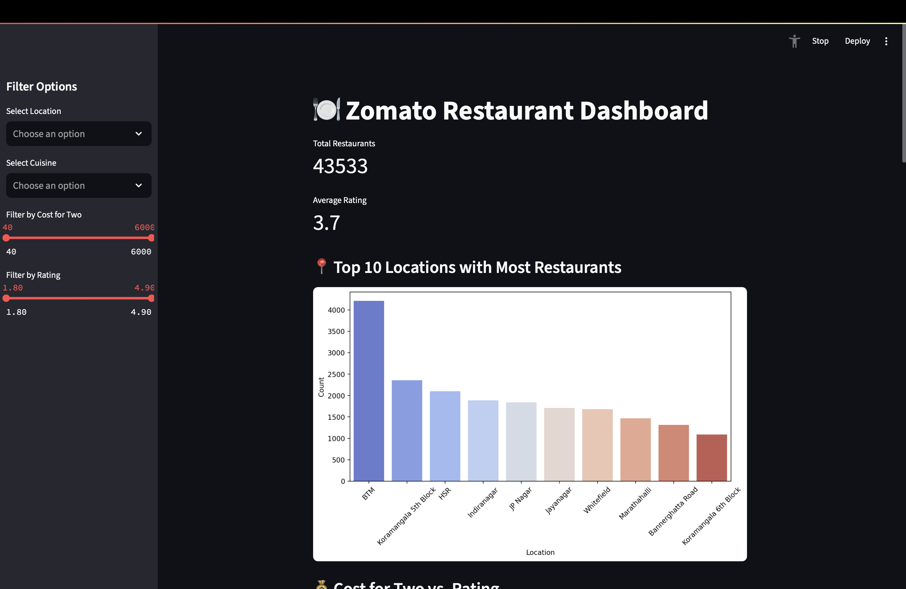
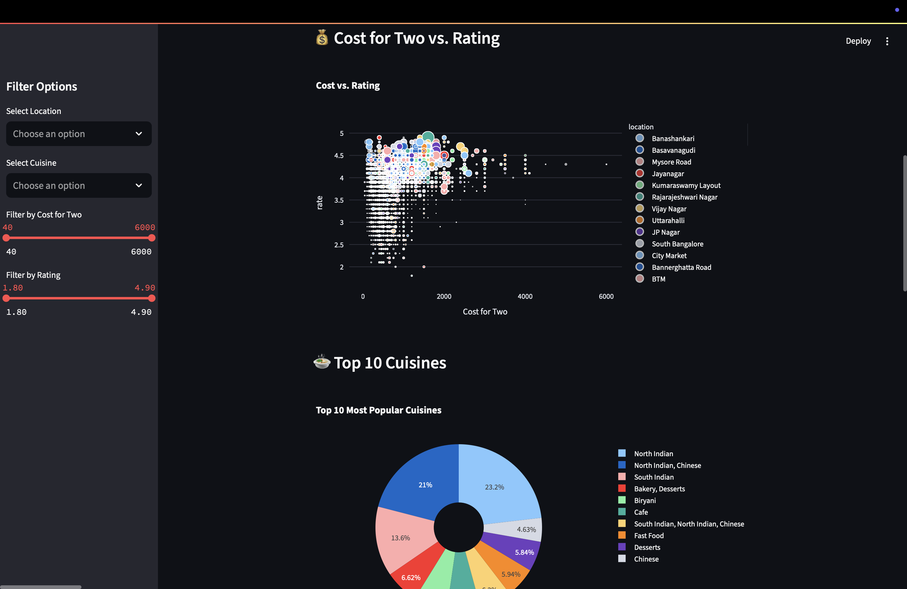
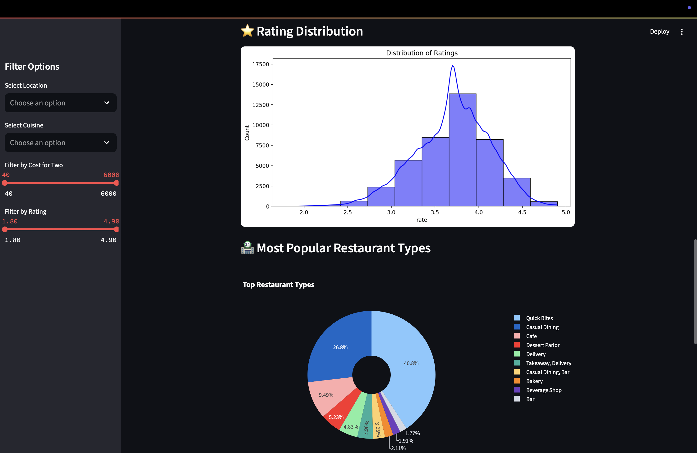
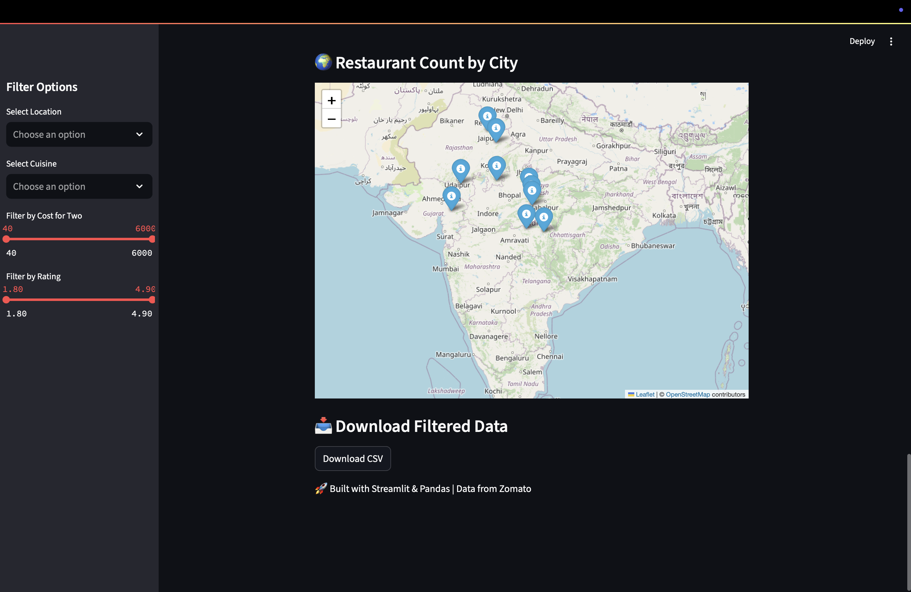
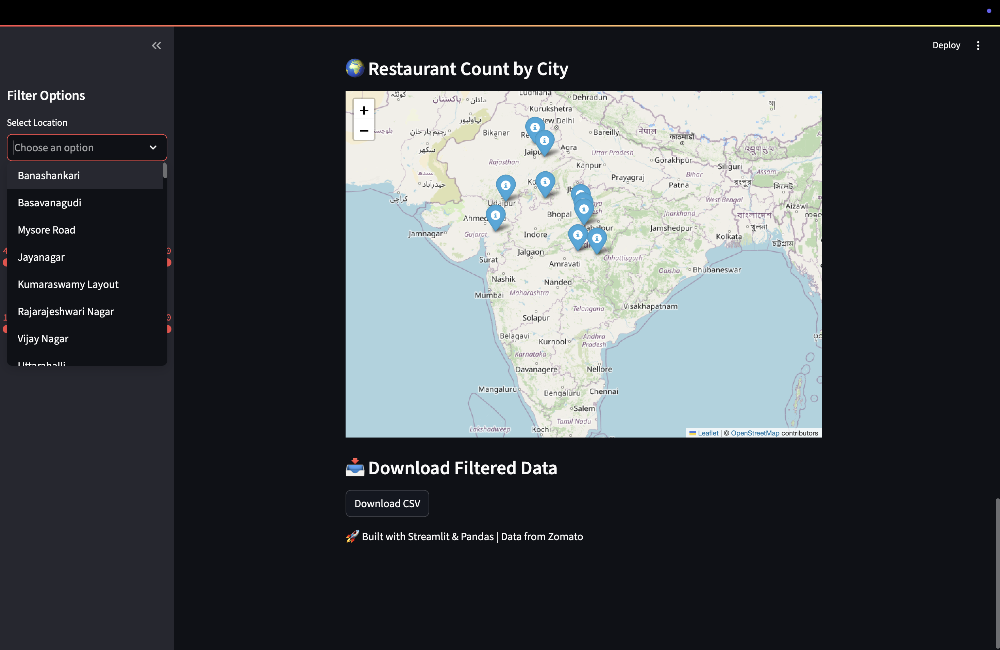

# 🍽️ Zomato Restaurant Data Dashboard (Streamlit)

An interactive Streamlit dashboard for exploring Zomato restaurant data using filters and visualizations.








---

## 🔍 Features

- Filter by city, rating, and cost
- Visualize cuisines, votes, and average costs
- Clean, interactive UI powered by Streamlit

---

## 📊 Tech Stack

- **Frontend/UI:** Streamlit
- **Backend/Data:** Python (Pandas, Seaborn, Plotly)
- **Visualization:** Matplotlib, Plotly, Seaborn
- **Data:** Zomato dataset (CSV)

---

## 🚀 Run Locally

```bash
# Clone the repository
git clone https://github.com/RudraShekhare/zomato-dashboard-streamlit.git
cd zomato-dashboard-streamlit
```

# Install dependencies
pip install -r requirements.txt

# Run the app
streamlit run app.py


# 🧠 Use Cases
Data-driven restaurant insights

Food-tech business analysis

Beginner-friendly data science demo

# 🙋‍♂️ Author
Rudra Shekhare
📧 rudra282805@gmail.com
🔗 LinkedIn : www.linkedin.com/in/rudra-shekhare-006987279

# ⭐ Like this project?
Star this repo and share it with others!
